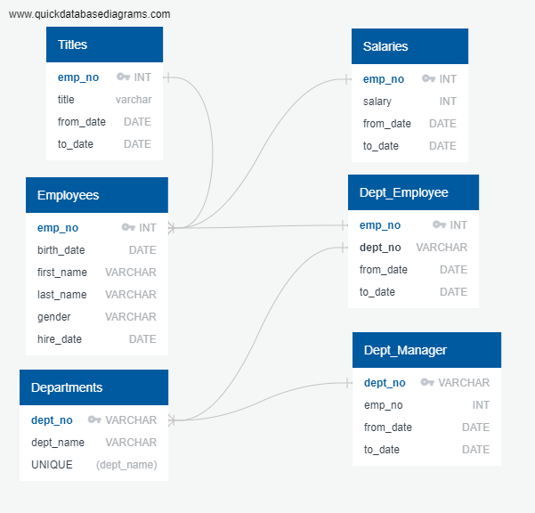

# Pewlett Hackard Analysis

## Overview
The purpose of this assignment was to establish the framework for a mentorship program within Pewlett Hackard in anticipation of simultaneous retirement among a large percentage of the workforce. This framework is the result of analysis done on the labor database for the company, and extracting all relevant information about the future retirees and their current departments. To determine which employees may be set to retire, the query criteria included only current employees who were born from 1952 to 1955. The candidates for the mentorship program were selected based on the criteria that they are a current employee born in 1965. 
## Results
  -Below is the ERD used to visualize the company’s employee database and relationships between data sources:
  
  -After conducting the analysis, it was found that 24.15% (72,458 retirees/300,025 total employees) are likely to retire.  
  
  -Below is the list of senior employees selected as candidates for the mentorship program. The query returned 1549 applicants that fit the criteria. 
  

## Summary 
Pewlett Hackard is considering 72,458 employees as potential retirees or mentors. Given their current criteria for mentorship candidates, only 1549 of those spots will be filled. Over the next few years, Pewlett Hackard will have to go through a serious hiring campaign to fill the empty positions at entry and junior levels, and will have to adjust their age criterion to fill in the senior level positions or else hire from outside the company. Interestingly enough, of the upper level staff about to retire only two of those are managers. Depending on how many manager positions need to be filled, this may or may not present an issue. 
